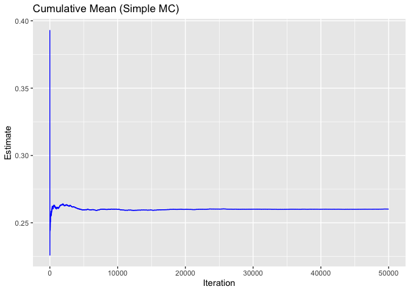
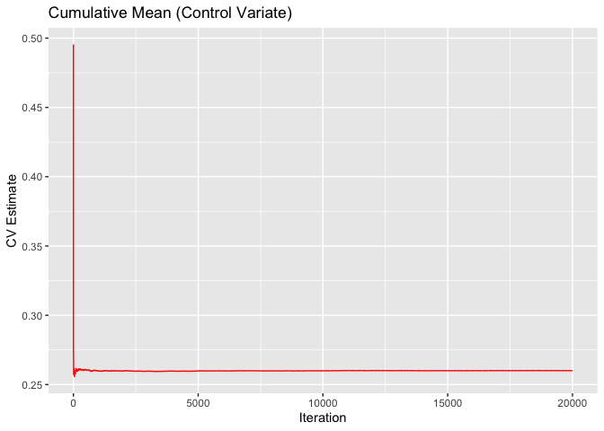
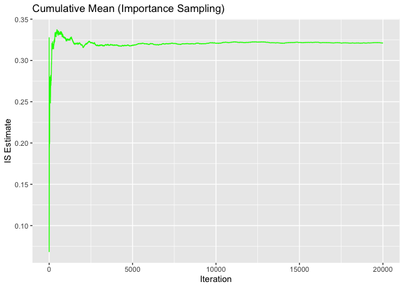
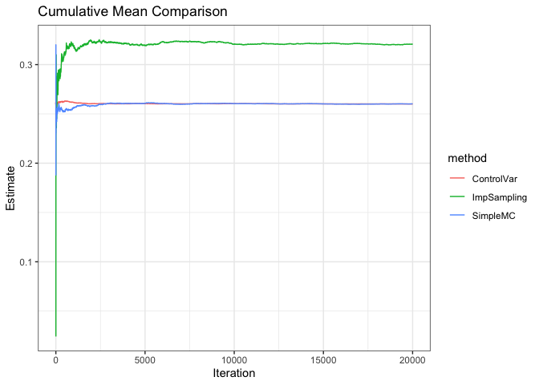

Group Project
================

## 1. Initialization and Function Definitions

``` r
library(ggplot2)

# Define logistic function
logistic <- function(z) {
  1 / (1 + exp(-z))
}

# Set model parameters
alpha <- 0        # Intercept
beta  <- 1        # Covariate coefficient

# Define random generators for non-normal distributions 
#                   of random effect b and covariate x
# Example: b ~ t_5 (heavy-tailed distribution)
r_b <- function(n) {
  rt(n, df = 5)
}

# Example: x ~ Gamma(shape=2, rate=1)
r_x <- function(n) {
  rgamma(n, shape = 2, rate = 1)
}
```

## 2. Simple Monte Carlo (MC)

``` r
simpleMC <- function(N) {
  # Sample b from f(b)
  b_samp <- r_b(N)
  # Sample x from f(x)
  x_samp <- r_x(N)
  
  # Compute p_i = logistic(alpha + b_i + beta*x_i)
  p_values <- logistic(alpha + b_samp + beta * x_samp)
  
  # Simple MC estimate is the average of p_values
  est <- mean(p_values)
  
  # Approximate standard error using sample SD / sqrt(N)
  #se  <- sd(p_values) / sqrt(N)
  
  #return(list(est = est, se = se))
  return(list(est = est))
}
```

## 3. Control Variate (CV)

``` r
# 3.1 Define a control variate g(b, x)
#     It should be correlated with the target function but have a known or easily
#     approximated expectation. As an example, we use a probit-based function.

g_function <- function(b, x) {
  # Example: replace logistic with pnorm (probit)
  z <- alpha + 0.8 * b + 0.8 * x  # 0.8 is a heuristic factor here
  return(pnorm(z))
}

# 3.2 Approximate E[g] using a large-scale MC, since we might not have a closed-form
approx_Eg <- function(N = 5e5) {
  b_samp <- r_b(N)
  x_samp <- r_x(N)
  mean(g_function(b_samp, x_samp))
}

# 3.3 Control variate MC estimate
cvMC <- function(N, Eg_true = NULL) {
  if(is.null(Eg_true)) {
    # If not provided, approximate E[g] with a bigger MC sample
    Eg_true <- approx_Eg(N = 5e5)
  }
  # Sample from original distributions
  b_samp <- r_b(N)
  x_samp <- r_x(N)
  
  # Target function p(b,x)
  p_vals <- logistic(alpha + b_samp + beta * x_samp)
  # Control variate g(b,x)
  g_vals <- g_function(b_samp, x_samp)
  
  # (1) Simple estimates of p and g
  p_mean <- mean(p_vals)
  g_mean <- mean(g_vals)
  
  # (2) Optimal gamma via covariance
  cov_pg <- cov(p_vals, g_vals)
  var_g  <- var(g_vals)
  gamma_opt <- cov_pg / var_g
  
  # (3) Construct CV estimator
  p_cv <- p_mean - gamma_opt * (g_mean - Eg_true)
  
  # This returns the CV estimate, gamma, and other useful metrics
  return(list(est = p_cv))
}
```

## 4. Importance Sampling (IS)

``` r
# 4.1 Define the auxiliary distribution h(b,x)
#     Here we show an example of independent sampling from h(b)*h(x).
#     We'll pick t_3 for b (heavier tail) and tweak Gamma parameters for x.

# b ~ t_3
r_b_IS <- function(n) {
  rt(n, df = 3)
}
# PDF of b for t_3
d_b_IS <- function(b) {
  dt(b, df = 3)
}

# x ~ Gamma(shape=2, rate=0.5)
r_x_IS <- function(n) {
  rgamma(n, shape = 2, rate = 0.5)
}
# PDF of x for Gamma(shape=2, rate=0.5)
d_x_IS <- function(x) {
  dgamma(x, shape = 2, rate = 0.5)
}

# 4.2 Implement Importance Sampling
IS_MC <- function(N) {
  # Sample from h(b,x)
  b_samp <- r_b_IS(N)
  x_samp <- r_x_IS(N)
  
  # Compute original PDF values f(b), f(x)
  fb_vals <- dt(b_samp, df = 5)             # original t_5 for b
  fx_vals <- dgamma(x_samp, shape = 2, rate = 1)  # original Gamma for x
  
  # Compute auxiliary PDF values h(b), h(x)
  hb_vals <- d_b_IS(b_samp)
  hx_vals <- d_x_IS(x_samp)
  
  # Weights w_i = [f(b_i)*f(x_i)] / [h(b_i)*h(x_i)]
  w <- (fb_vals * fx_vals) / (hb_vals * hx_vals)
  
  # Target function p(b,x)
  p_vals <- logistic(alpha + b_samp + beta * x_samp)
  
  # IS estimate (unbiased if we average p*w)
  est <- mean(p_vals * w)
  
  # Rough variance estimate
  #p_var <- mean((p_vals * w)^2) - p_hat^2
  #se  <- sqrt(p_var / N)
  
  #return(list(est = est, se = se, w_mean = mean(w)))
  return(list(est = est))
}
```

## 5. Compare bias, variance, and CPU time for three methods

``` r
# 5.1. Obtain a "true value" via a large-scale Simple MC
set.seed(9999)
N_large <- 5e6  

res_truth <- simpleMC(N_large)
true_value <- res_truth$est
cat("Approx. True Value =", true_value, "\n")
```

    ## Approx. True Value = 0.7859166

``` r
# 5.2. Repeat simulations for smaller N and compare bias, variance
simulate_three_methods <- function(N, Eg_true) {
  # Simple MC
  res_mc <- simpleMC(N)
  # CV
  res_cv <- cvMC(N, Eg_true = Eg_true)
  # IS
  res_is <- IS_MC(N)
  
  c(mc = res_mc$est, cv = res_cv$est, is = res_is$est)
}

set.seed(1234)
N_reps <- 50        # number of repeated simulations
N_small <- 1e5      # sample size for each repeated run


# Pre-calculate Eg_true for CV (to avoid doing it multiple times)
Eg_val <- approx_Eg(N=5e5)  

results_matrix <- replicate(N_reps, simulate_three_methods(N_small, Eg_true = Eg_val))
# results_matrix is now 3 x N_reps, each column is one replicate

mc_est <- results_matrix["mc", ]
cv_est <- results_matrix["cv", ]
is_est <- results_matrix["is", ]

# Compute mean estimate, bias, variance
mc_mean <- mean(mc_est)
cv_mean <- mean(cv_est)
is_mean <- mean(is_est)

mc_bias <- mc_mean - true_value
cv_bias <- cv_mean - true_value
is_bias <- is_mean - true_value

mc_var <- var(mc_est)
cv_var <- var(cv_est)
is_var <- var(is_est)

df_comparison <- data.frame(
  method   = c("MC", "CV", "IS"),
  mean_est = c(mc_mean, cv_mean, is_mean),
  bias     = c(mc_bias, cv_bias, is_bias),
  variance = c(mc_var, cv_var, is_var)
)

df_comparison
```

    ##   method  mean_est          bias     variance
    ## 1     MC 0.7857719 -0.0001446686 4.415522e-07
    ## 2     CV 0.7857767 -0.0001399315 8.385587e-09
    ## 3     IS 0.7855314 -0.0003851632 3.016384e-06

``` r
# 5.3 Compare CPU time
library(microbenchmark)

test_time <- microbenchmark(
  MC = { simpleMC(N_small) },
  CV = { cvMC(N_small, Eg_true = Eg_val) },
  IS = { IS_MC(N_small) },
  times = 10  # repeat each method 10 times
)

test_time
```

    ## Unit: milliseconds
    ##  expr      min       lq     mean   median       uq      max neval
    ##    MC 16.20951 16.23071 16.30034 16.28684 16.36236 16.45929    10
    ##    CV 19.23786 19.49886 19.58981 19.59892 19.77061 19.96823    10
    ##    IS 43.71231 44.04897 44.84207 44.38113 44.77196 47.80141    10

- **Monte Carlo (MC)** is the fastest because it only generates random
  samples and computes the mean, with O(N) complexity and no additional
  calculations.
- **Control Variates (CV)** is slightly slower due to the extra step of
  computing a regression coefficient to reduce variance, but it improves
  estimation accuracy.
- **Importance Sampling (IS)** is the slowest because it requires
  computing importance weights, normalizing them, and handling
  probability density functions, making it computationally more
  expensive (O(N log N) or higher).

## 6. Performance Comparison and Convergence Visualization

### Simple MC

``` r
# 6.1 Example of cumulative mean for Simple MC
cumulative_MC <- function(N) {
  b_samp <- r_b(N)
  x_samp <- r_x(N)
  p_vals <- logistic(alpha + b_samp + beta * x_samp)
  cum_mean <- cumsum(p_vals) / seq_len(N)
  return(cum_mean)
}

# 6.2 Plot cumulative mean
set.seed(999)
N <- 5e4
cm_mc <- cumulative_MC(N)

df_mc <- data.frame(
  iter = 1:N,
  mean_est = cm_mc
)

ggplot(df_mc, aes(x = iter, y = mean_est)) +
  geom_line(color = "blue") +
  labs(title = "Cumulative Mean (Simple MC)",
       x = "Iteration",
       y = "Estimate")
```

<!-- -->

### Control Variate Cumulative Mean

``` r
# This function returns a vector of CV estimates for i from 1 to N.
cumulative_CV <- function(N, Eg_true = NULL, largeN_approx = 5e5) {
  if (is.null(Eg_true)) {
    # If E[g] is not provided, approximate with a larger MC
    Eg_true <- approx_Eg(N = largeN_approx)
  }
  
  # Sample from original distributions
  b_samp <- r_b(N)
  x_samp <- r_x(N)
  
  # Compute p(b,x) and g(b,x)
  p_vals <- logistic(alpha + b_samp + beta * x_samp)
  g_vals <- g_function(b_samp, x_samp)
  
  # We will keep track of partial sums to compute means, covariance, etc.
  cum_p  <- cumsum(p_vals)
  cum_g  <- cumsum(g_vals)
  cum_pg <- cumsum(p_vals * g_vals)   # needed for Cov(p,g)
  cum_g2 <- cumsum(g_vals^2)         # needed for Var(g)
  
  # Vector to store CV estimates at each iteration
  pCV_cum <- numeric(N)
  
  # The first data point (i=1) does not allow us to compute a covariance
  # We can simply set pCV_cum[1] to p_vals[1], or NA, etc.
  pCV_cum[1] <- p_vals[1]
  
  # Loop over i = 2 to N
  for (i in 2:N) {
    # partial means
    p_bar_i <- cum_p[i] / i
    g_bar_i <- cum_g[i] / i
    
    # Cov(p,g) = E[ p*g ] - E[p]*E[g ]
    # partial estimate of E[p*g] = cum_pg[i] / i
    pg_bar_i <- cum_pg[i] / i
    cov_pg_i <- pg_bar_i - (p_bar_i * g_bar_i)
    
    # Var(g) = E[g^2] - (E[g])^2
    g2_bar_i <- cum_g2[i] / i
    var_g_i  <- g2_bar_i - (g_bar_i^2)
    
    # Optimal gamma
    gamma_i <- cov_pg_i / var_g_i
    
    # CV estimate at iteration i
    pCV_cum[i] <- p_bar_i - gamma_i * (g_bar_i - Eg_true)
  }
  
  return(pCV_cum)
}

# Example usage and plotting:
set.seed(1234)
N <- 20000
cv_cum_values <- cumulative_CV(N)

df_cv <- data.frame(
  iter = 1:N,
  cv_est = cv_cum_values
)

library(ggplot2)
ggplot(df_cv, aes(x = iter, y = cv_est)) +
  geom_line(color = "red") +
  labs(title = "Cumulative Mean (Control Variate)",
       x = "Iteration",
       y = "CV Estimate")
```

<!-- -->

### Importance Sampling Cumulative Mean

``` r
cumulative_IS <- function(N) {
  # Sample from auxiliary distribution h(b,x)
  b_samp <- r_b_IS(N)
  x_samp <- r_x_IS(N)
  
  # Compute original PDF f(b), f(x)
  fb_vals <- dt(b_samp, df = 5)          # original b ~ t_5
  fx_vals <- dgamma(x_samp, shape=2, rate=1)   # original x ~ Gamma(2,1)
  
  # Compute auxiliary PDF h(b), h(x)
  hb_vals <- d_b_IS(b_samp)
  hx_vals <- d_x_IS(x_samp)
  
  # Weights
  w <- (fb_vals * fx_vals) / (hb_vals * hx_vals)
  
  # Target function p(b,x)
  p_vals <- logistic(alpha + b_samp + beta * x_samp)
  
  # Build cumulative sums
  cum_w  <- cumsum(w)
  cum_pw <- cumsum(p_vals * w)
  
  # IS estimate at iteration i: cum_pw[i] / cum_w[i]
  pIS_cum <- cum_pw / cum_w
  
  return(pIS_cum)
}

## Example usage and plotting:
set.seed(5678)
N <- 20000
is_cum_values <- cumulative_IS(N)

df_is <- data.frame(
  iter = 1:N,
  is_est = is_cum_values
)

ggplot(df_is, aes(x = iter, y = is_est)) +
  geom_line(color = "green") +
  labs(title = "Cumulative Mean (Importance Sampling)",
       x = "Iteration",
       y = "IS Estimate")
```

<!-- -->

``` r
N <- 20000
set.seed(999)

# 1. Simple MC
cm_mc <- cumulative_MC(N)
df_mc <- data.frame(iter = 1:N, method = "SimpleMC", estimate = cm_mc)

# 2. CV
cm_cv <- cumulative_CV(N)
df_cv <- data.frame(iter = 1:N, method = "ControlVar", estimate = cm_cv)

# 3. IS
cm_is <- cumulative_IS(N)
df_is <- data.frame(iter = 1:N, method = "ImpSampling", estimate = cm_is)

# Combine
df_all <- rbind(df_mc, df_cv, df_is)

ggplot(df_all, aes(x = iter, y = estimate, color = method)) +
  geom_line() +
  labs(title = "Cumulative Mean Comparison",
       x = "Iteration",
       y = "Estimate") +
  theme_bw()
```

<!-- -->
